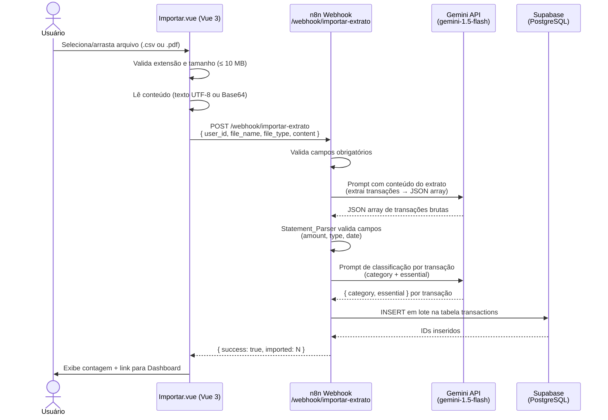

# Design Técnico — bank-statement-import

## Overview

A feature `bank-statement-import` adiciona ao app Finanças Pessoais a capacidade de importar extratos bancários em lote. O usuário acessa a rota `/importar`, faz upload de um arquivo `.csv` ou `.pdf`, e o sistema processa automaticamente todas as transações contidas no extrato — classificando-as por categoria e essencialidade, e salvando-as no Supabase.

O fluxo é dividido em duas partes:

1. **Frontend (Vue 3)** — página `Importar.vue` com área de drag & drop, validação local, envio ao webhook e feedback visual de resultado.
2. **Backend (n8n)** — novo workflow `importar-extrato` que recebe o payload, usa o Gemini para interpretar o extrato (independente do banco), valida e classifica cada transação, e insere em lote no Supabase.

A feature reutiliza a lógica de classificação já existente no workflow `/webhook/financas` e segue o mesmo design system (paleta gold/amber escura, fontes DM Sans/Serif/Mono, CSS variables).

---

## Architecture



### Decisões de Arquitetura

- **Gemini para extração e classificação**: O mesmo modelo já usado no workflow `/financas` é reutilizado. A extração de transações e a classificação são feitas em chamadas separadas para manter prompts focados e facilitar o tratamento de erros.
- **Classificação em lote via loop n8n**: O nó `SplitInBatches` itera sobre as transações extraídas, chamando o Gemini para classificar cada uma — reutilizando a lógica do workflow existente sem duplicar código.
- **PDF via Base64**: O frontend não depende de bibliotecas de parsing de PDF. O conteúdo é enviado como Base64 e o n8n usa um nó Code para decodificar antes de enviar ao Gemini, que tem capacidade nativa de interpretar texto extraído de PDFs.
- **Inserção em lote**: Todas as transações válidas são inseridas em uma única operação `INSERT` no Supabase para minimizar latência e garantir atomicidade parcial (transações inválidas são descartadas individualmente, não abortam o lote).
- **Sem dependências novas no frontend**: A implementação usa apenas a File API nativa do navegador (`FileReader`) e `fetch`, sem adicionar bibliotecas externas.

---

## Components and Interfaces

### Frontend

#### `Importar.vue`
Página principal da feature. Responsável por toda a interação do usuário.

**Estado interno:**
```js
const file = ref(null)           // File object selecionado
const isDragging = ref(false)    // estado visual do drag
const status = ref('idle')       // 'idle' | 'loading' | 'success' | 'error'
const importedCount = ref(0)     // transações importadas com sucesso
const errorMessage = ref('')     // mensagem de erro descritiva
const validationError = ref('')  // erro de validação local (extensão/tamanho)
```

**Funções principais:**
```js
// Drag & Drop handlers
onDragOver(e)    // previne default, ativa isDragging
onDragLeave(e)   // desativa isDragging
onDrop(e)        // captura e.dataTransfer.files[0], chama validateFile()

// Seleção manual
onFileSelect(e)  // captura e.target.files[0], chama validateFile()

// Validação
validateFile(f)  // verifica extensão e tamanho, seta validationError ou file

// Envio
async sendFile() // lê conteúdo, monta payload, POST ao webhook, trata resposta

// Reset
resetState()     // volta ao estado 'idle', limpa file e erros
```

**Payload enviado ao webhook:**
```json
{
  "user_id": "uuid-do-usuario",
  "file_name": "extrato-janeiro.csv",
  "file_type": "csv",
  "content": "<texto UTF-8 ou string Base64>"
}
```

**Headers da requisição:**
```
Content-Type: application/json
x-webhook-secret: <VITE_WEBHOOK_SECRET>
```

#### Integração com `router.js`
Nova rota adicionada:
```js
{ path: '/importar', component: () => import('./views/Importar.vue') }
```
A rota não recebe `meta: { public: true }`, portanto o guard existente já garante autenticação.

#### Integração com `App.vue`
Novo link de navegação adicionado ao `<nav>`:
```html
<RouterLink to="/importar">Importar</RouterLink>
```

---

### Backend (n8n)

#### Workflow: `Importar Extrato`

Nós do workflow em ordem de execução:

| # | Nome | Tipo | Responsabilidade |
|---|------|------|-----------------|
| 1 | Webhook | `n8n-nodes-base.webhook` | Recebe POST em `/webhook/importar-extrato` |
| 2 | Validar Payload | `n8n-nodes-base.code` | Verifica campos obrigatórios; retorna 400 se inválido |
| 3 | Preparar Conteúdo | `n8n-nodes-base.code` | Decodifica Base64 (PDF) ou passa texto direto (CSV) |
| 4 | Gemini — Extrair Transações | `n8n-nodes-base.httpRequest` | Chama Gemini com prompt de extração; retorna JSON array |
| 5 | Parsear Resposta Gemini | `n8n-nodes-base.code` | Faz JSON.parse, valida estrutura; retorna 422 se inválido |
| 6 | Validar Transações | `n8n-nodes-base.code` | Filtra transações com campos inválidos; descarta inválidas |
| 7 | Tem Transações? | `n8n-nodes-base.if` | Bifurca: zero transações → resposta 200 com imported:0 |
| 8 | Split em Itens | `n8n-nodes-base.splitInBatches` | Itera sobre cada transação para classificação |
| 9 | Gemini — Classificar | `n8n-nodes-base.httpRequest` | Reutiliza prompt do workflow `/financas` |
| 10 | Extrair Classificação | `n8n-nodes-base.code` | Extrai category e essential da resposta Gemini |
| 11 | Agregar Transações | `n8n-nodes-base.code` | Coleta todas as transações classificadas em array |
| 12 | Inserir no Supabase | `n8n-nodes-base.httpRequest` | POST na Supabase REST API (insert em lote) |
| 13 | Responder Sucesso | `n8n-nodes-base.respondToWebhook` | Retorna `{ success: true, imported: N }` |
| 14 | Responder Zero | `n8n-nodes-base.respondToWebhook` | Retorna `{ success: true, imported: 0 }` |
| 15 | Responder Erro | `n8n-nodes-base.respondToWebhook` | Retorna erro HTTP 400/422 com mensagem |

---

## Data Models

### Payload de Entrada (Frontend → Webhook)

```typescript
interface ImportPayload {
  user_id: string        // UUID do usuário autenticado (Supabase Auth)
  file_name: string      // Nome original do arquivo (ex: "extrato.csv")
  file_type: 'csv' | 'pdf'
  content: string        // Texto UTF-8 (CSV) ou Base64 (PDF)
}
```

### Transação Bruta (Gemini → Statement_Parser)

```typescript
interface RawTransaction {
  description: string    // Descrição da transação conforme extrato
  amount: number         // Valor positivo (ex: 1234.56)
  type: 'income' | 'expense'
  date: string           // ISO 8601: "YYYY-MM-DD"
}
```

### Transação Classificada (Statement_Parser → Supabase)

```typescript
interface ClassifiedTransaction {
  user_id: string
  description: string
  amount: number
  type: 'income' | 'expense'
  category: string       // Uma das categorias padrão do sistema
  date: string           // ISO 8601
  essential: boolean
}
```

### Resposta do Webhook (Webhook → Frontend)

```typescript
// Sucesso
interface ImportSuccess {
  success: true
  imported: number       // Quantidade de transações salvas
}

// Erro de validação de payload
interface ImportError400 {
  success: false
  error: string          // Ex: "Campo 'user_id' ausente"
}

// Erro de parsing Gemini
interface ImportError422 {
  success: false
  error: string          // Ex: "Não foi possível interpretar o extrato"
}
```

### Tabela `transactions` (Supabase — existente)

```sql
-- Tabela já existente, sem alterações de schema necessárias
CREATE TABLE transactions (
  id          UUID PRIMARY KEY DEFAULT gen_random_uuid(),
  user_id     UUID NOT NULL REFERENCES auth.users(id),
  description TEXT NOT NULL,
  amount      NUMERIC(12, 2) NOT NULL,
  type        TEXT NOT NULL CHECK (type IN ('income', 'expense')),
  category    TEXT NOT NULL,
  date        DATE NOT NULL,
  essential   BOOLEAN NOT NULL DEFAULT false,
  created_at  TIMESTAMPTZ DEFAULT now()
);
```

### Prompt Gemini — Extração de Transações

```
Você é um parser de extratos bancários brasileiros.
Analise o conteúdo abaixo e extraia TODAS as transações financeiras.

Retorne APENAS um array JSON válido, sem markdown, sem explicações.
Cada item deve ter exatamente estes campos:
- description: string (descrição da transação)
- amount: number (valor positivo, sem símbolo de moeda)
- type: "income" ou "expense" (crédito = income, débito = expense)
- date: string no formato "YYYY-MM-DD"

Se não houver transações identificáveis, retorne: []

Conteúdo do extrato:
<CONTENT>
```

### Prompt Gemini — Classificação (reutilizado do workflow `/financas`)

```
Analise esta transação financeira e retorne um JSON.

Descrição: <description>
Tipo: <type>
Valor: R$ <amount>

Regras:
- Confirme ou corrija a categoria para uma destas: Salário, Freelance, Alimentação, Moradia, Transporte, Saúde, Educação, Lazer, Outros
- Determine se é gasto ESSENCIAL (necessidade básica: alimentação, moradia, saúde, transporte, educação) ou SUPÉRFLUO (lazer, luxo, entretenimento)
- Entradas (salário, freelance) são sempre essential: false

Responda APENAS com JSON válido: {"category": "NomeCategoria", "essential": true}
```

---

## Correctness Properties

*A property is a characteristic or behavior that should hold true across all valid executions of a system — essentially, a formal statement about what the system should do. Properties serve as the bridge between human-readable specifications and machine-verifiable correctness guarantees.*

### Property 1: Validação de arquivo rejeita extensão ou tamanho inválidos

*Para qualquer* arquivo cujo nome não termine em `.csv` ou `.pdf` (case-insensitive), **ou** cujo tamanho exceda 10.485.760 bytes (10 MB), a função `validateFile` SHALL setar `validationError` com mensagem não-vazia, manter `file` como `null` e manter o botão de envio desabilitado.

**Validates: Requirements 4.1, 4.2, 4.3, 4.4**

---

### Property 2: Arquivo válido habilita envio sem erros

*Para qualquer* arquivo com extensão `.csv` ou `.pdf` (case-insensitive) e tamanho ≤ 10.485.760 bytes, a função `validateFile` SHALL setar `file` com o objeto File recebido, manter `validationError` como string vazia e habilitar o botão de envio.

**Validates: Requirements 4.5**

---

### Property 3: Codificação do conteúdo é determinada pelo tipo de arquivo

*Para qualquer* arquivo `.csv`, o campo `content` no payload enviado ao webhook SHALL ser a string de texto UTF-8 original do arquivo. *Para qualquer* arquivo `.pdf`, o campo `content` SHALL ser uma string Base64 tal que `atob(content)` produza o conteúdo binário original sem erro (round-trip de codificação).

**Validates: Requirements 5.2, 5.3**

---

### Property 4: Payload de envio sempre contém todos os campos obrigatórios

*Para qualquer* arquivo válido enviado por qualquer usuário autenticado, o objeto JSON enviado ao webhook SHALL conter os campos `user_id`, `file_name`, `file_type` e `content` — todos com valores não-nulos e não-vazios.

**Validates: Requirements 5.4**

---

### Property 5: Descarte seletivo preserva transações válidas e conta apenas as salvas

*Para qualquer* array de N transações extraídas pelo Gemini onde K transações possuem campos inválidos (`amount` ≤ 0 ou não-numérico, `type` fora de `"income"/"expense"`, ou `date` não parseável como data válida), o Statement_Parser SHALL: (a) descartar exatamente as K inválidas sem afetar as N−K válidas, e (b) o campo `imported` na resposta final SHALL ser igual a N−K.

**Validates: Requirements 8.4, 8.5, 8.6, 7.8**

---

### Property 6: Erros HTTP do webhook sempre disponibilizam retry

*Para qualquer* código de resposta HTTP entre 400 e 599 retornado pelo webhook, o estado da página SHALL ser `'error'`, uma mensagem de erro SHALL ser exibida, e o botão "Tentar novamente" SHALL estar disponível e funcional.

**Validates: Requirements 6.3**

---

### Property 7: Reset restaura estado inicial após qualquer erro

*Para qualquer* estado de erro da página (independente da causa: extensão inválida, tamanho excedido, erro de rede, erro HTTP), chamar `resetState()` SHALL resultar em: `status === 'idle'`, `file === null`, `validationError === ''`, `errorMessage === ''`.

**Validates: Requirements 6.6**

---

### Property 8: Webhook rejeita payload com campos obrigatórios ausentes

*Para qualquer* subconjunto não-vazio de campos obrigatórios (`user_id`, `file_type`, `content`) ausentes no payload recebido, o Import_Webhook SHALL retornar HTTP 400 com um campo `error` descrevendo qual campo está faltando.

**Validates: Requirements 7.1, 7.2**

---

### Property 9: Resposta Gemini inválida resulta em HTTP 422

*Para qualquer* string retornada pelo Gemini que não seja JSON válido e parseável como array, o Import_Webhook SHALL retornar HTTP 422 com `{ success: false, error: "..." }`.

**Validates: Requirements 8.3**

---

### Property 10: Normalização de valores e datas é independente do formato de origem

*Para qualquer* valor monetário no formato brasileiro (ex: `"R$ 1.234,56"`, `"1.234,56"`, `"1234,56"`) presente no extrato, o Gemini_Extractor SHALL retornar `amount` como número decimal positivo equivalente (ex: `1234.56`). *Para qualquer* data no extrato (ex: `"15/01/2024"`, `"15-01-2024"`, `"Jan 15, 2024"`), o Gemini_Extractor SHALL retornar `date` no formato `"YYYY-MM-DD"` válido.

**Validates: Requirements 9.3, 9.4**

---

## Error Handling

### Frontend

| Situação | Comportamento |
|----------|--------------|
| Extensão inválida | `validationError` exibe mensagem; botão de envio desabilitado |
| Arquivo > 10 MB | `validationError` exibe mensagem; botão de envio desabilitado |
| Erro de rede (fetch falha) | `status = 'error'`; mensagem de conectividade; botão "Tentar novamente" |
| HTTP 4xx do webhook | `status = 'error'`; exibe `error` do body JSON; botão "Tentar novamente" |
| HTTP 5xx do webhook | `status = 'error'`; mensagem genérica de servidor; botão "Tentar novamente" |
| `imported: 0` com sucesso | `status = 'success'`; mensagem "Nenhuma transação encontrada" |
| `imported: N > 0` | `status = 'success'`; mensagem com contagem; link para Dashboard |

### Backend (n8n)

| Situação | HTTP | Resposta |
|----------|------|----------|
| Campo obrigatório ausente | 400 | `{ success: false, error: "Campo 'X' ausente" }` |
| JSON do Gemini inválido | 422 | `{ success: false, error: "Não foi possível interpretar o extrato" }` |
| Gemini retorna `[]` | 200 | `{ success: true, imported: 0 }` |
| Erro na inserção Supabase | 500 | `{ success: false, error: "Erro ao salvar transações" }` |
| Todas transações descartadas | 200 | `{ success: true, imported: 0 }` |

**Estratégia de resiliência no loop de classificação:**
- Se o Gemini falhar ao classificar uma transação individual, o nó `Extrair Classificação` usa valores padrão: `category: "Outros"`, `essential: false` — garantindo que a transação não seja descartada por falha de classificação.

---

## Testing Strategy

### Abordagem Dual

A estratégia combina testes de exemplo (unitários) para comportamentos específicos e testes baseados em propriedades (PBT) para validar invariantes universais.

### Testes de Propriedade (PBT)

Biblioteca recomendada: **[fast-check](https://github.com/dubzzz/fast-check)** (JavaScript/TypeScript, compatível com Vitest).

Cada teste de propriedade deve rodar com **mínimo de 100 iterações**.

Tag de referência: `Feature: bank-statement-import, Property N: <texto>`

| Propriedade | Geradores | O que varia | Asserção |
|-------------|-----------|-------------|----------|
| P1 — Validação rejeita inválidos | Nomes de arquivo com extensões aleatórias; tamanhos aleatórios | Extensão, tamanho | `validateFile` retorna erro para extensão ≠ csv/pdf ou tamanho > 10MB |
| P2 — Arquivo válido habilita envio | Nomes `.csv`/`.pdf` com tamanho ≤ 10MB | Conteúdo, nome | `file` não-nulo, `validationError` vazio |
| P3 — Codificação por tipo | Strings de conteúdo aleatórias | Conteúdo do arquivo | CSV → texto legível; PDF → Base64 decodificável |
| P4 — Payload completo | Usuários e arquivos válidos aleatórios | user_id, file_name, conteúdo | Todos os 4 campos presentes e não-vazios |
| P5 — Descarte seletivo | Arrays mistos de transações válidas/inválidas | Proporção de inválidas, tipo de invalidade | Apenas inválidas descartadas; válidas preservadas |
| P6 — Contagem correta | Arrays com K inválidas de N totais | N, K | `imported === N - K` |
| P7 — Normalização monetária | Valores em formatos BR aleatórios | Formato do valor | `amount` é número positivo |
| P8 — Normalização de datas | Datas em formatos variados | Formato da data | `date` é `YYYY-MM-DD` válido |

### Testes de Exemplo (Unitários)

- `validateFile` com arquivo `.txt` → erro de extensão
- `validateFile` com arquivo de 11 MB → erro de tamanho
- `validateFile` com `.CSV` (maiúsculo) → aceito (case-insensitive)
- Envio de CSV → `content` é string de texto
- Envio de PDF → `content` é string Base64 válida
- Webhook recebe payload sem `user_id` → retorna HTTP 400
- Gemini retorna JSON malformado → retorna HTTP 422
- Gemini retorna `[]` → resposta `{ success: true, imported: 0 }`
- Transação com `amount: -50` → descartada
- Transação com `type: "debit"` → descartada
- Transação com `date: "32/13/2024"` → descartada

### Testes de Integração

- Upload de CSV real de banco brasileiro → transações aparecem no Dashboard
- Upload de PDF real → transações extraídas e classificadas corretamente
- Usuário não autenticado acessa `/importar` → redirecionado para `/login`
- Webhook sem header `x-webhook-secret` → comportamento de segurança esperado

### Cobertura de Múltiplos Bancos (Smoke Tests)

Testar manualmente com extratos reais de ao menos:
- Nubank (CSV)
- Itaú (CSV/PDF)
- Bradesco (CSV)
- Inter (CSV)
- C6 Bank (CSV)
