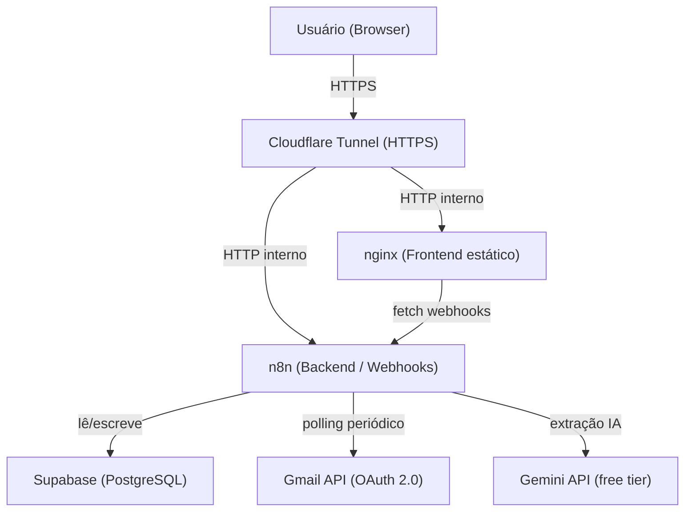
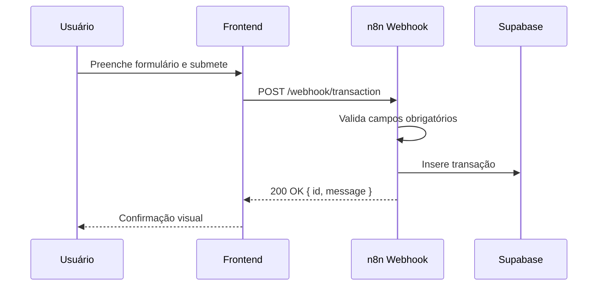
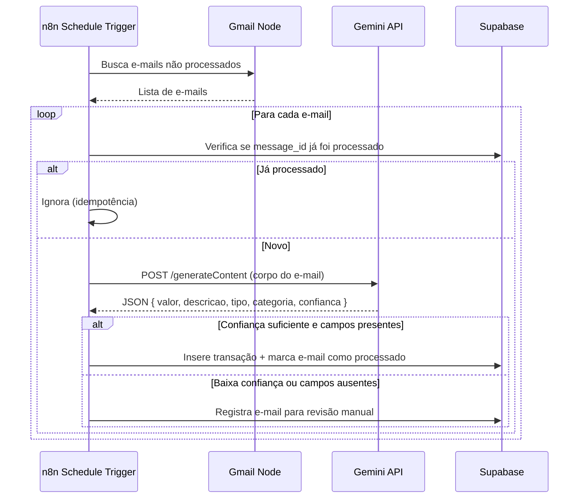

# Design Técnico — Personal Finance Tracker

## Overview

O Personal Finance Tracker é um sistema de controle financeiro pessoal composto por:

- **Backend n8n**: instância Docker que centraliza automações e exposição de webhooks REST, persistindo dados no Supabase (PostgreSQL).
- **Frontend**: página web estática (HTML/CSS/JS vanilla) servida via nginx no mesmo servidor, consumindo os webhooks do n8n.
- **Gmail Monitor**: workflow n8n com trigger periódico que lê comprovantes bancários via Gmail API (OAuth 2.0).
- **Gemini API**: chamada HTTP do n8n para extração inteligente de dados dos e-mails.
- **Cloudflare Tunnel**: expõe n8n e frontend via HTTPS sem abrir portas no firewall da Oracle Cloud.



---

## Architecture

### Camadas

| Camada | Tecnologia | Responsabilidade |
|---|---|---|
| Apresentação | HTML/CSS/JS + nginx | UI, formulários, gráficos (Chart.js) |
| Automação/API | n8n (Docker) | Webhooks, lógica de negócio, agendamentos |
| Persistência | Supabase (PostgreSQL free tier) | Armazenamento externo gerenciado de transações, metas, alertas, e-mails processados |
| Integração | Gmail API + Gemini API | Leitura de comprovantes e extração de dados com IA |
| Rede | Cloudflare Tunnel + cloudflared | HTTPS público sem exposição de portas |
| Infraestrutura | Oracle Cloud ARM Ampere + Ubuntu + Docker Compose | Hospedagem gratuita |

### Fluxo principal — Registro manual de transação



### Fluxo principal — Importação automática via Gmail



---

## Components and Interfaces

### 1. Webhooks n8n (Backend API)

Todos os endpoints são webhooks n8n expostos via Cloudflare Tunnel.

| Método | Path | Descrição |
|---|---|---|
| POST | `/webhook/transaction` | Cria nova transação |
| GET | `/webhook/transactions` | Lista transações (query: `start`, `end`, `category`, `type`) |
| GET | `/webhook/report` | Relatório mensal (query: `year`, `month`) |
| GET | `/webhook/export` | Exporta CSV (query: `start`, `end`) |
| POST | `/webhook/goal` | Cria/atualiza meta de economia |
| GET | `/webhook/goal` | Retorna meta ativa e progresso |
| POST | `/webhook/alert-rule` | Cria regra de alerta por categoria |
| GET | `/webhook/alerts` | Lista alertas ativos |
| GET | `/webhook/categories` | Lista categorias disponíveis |
| POST | `/webhook/category` | Cria categoria personalizada |
| DELETE | `/webhook/category/:id` | Remove categoria personalizada |
| GET | `/webhook/pending-emails` | Lista e-mails pendentes de revisão manual |

#### Contrato de resposta padrão

```json
// Sucesso
{ "success": true, "data": { ... } }

// Erro de validação
{ "success": false, "error": "Campo 'valor' é obrigatório" }
```

### 2. Frontend (nginx + HTML/JS)

- Página única com seções: Dashboard, Histórico, Relatório, Metas, Alertas, Exportar, E-mails Pendentes.
- Comunicação exclusivamente via `fetch()` para os webhooks n8n.
- Gráficos com Chart.js (CDN).
- Sem framework JS — vanilla para manter simplicidade.

### 3. Gmail Monitor Workflow (n8n)

- **Trigger**: Schedule Trigger (ex: a cada 15 minutos).
- **Node Gmail**: busca e-mails com labels/filtros de remetentes bancários.
- **Node Postgres**: verifica idempotência consultando tabela `processed_emails` no Supabase; insere transações e registros de e-mails processados.
- **Node HTTP Request**: chama Gemini API.
- **Node IF**: ramifica por confiança da resposta.
- **Node n8n interno**: insere transação ou registra para revisão.

### 4. Gemini API Integration

- Endpoint: `https://generativelanguage.googleapis.com/v1beta/models/gemini-1.5-flash:generateContent`
- Autenticação: query param `?key={{$env.GEMINI_API_KEY}}`
- Prompt estruturado enviado com o corpo do e-mail solicitando JSON com campos: `valor` (number), `descricao` (string), `tipo` ("debito"|"credito"), `categoria` (string), `confianca` (0.0–1.0).
- Threshold de confiança: `>= 0.7` para criação automática.

### 5. Infraestrutura Docker Compose

```yaml
# docker-compose.yml (estrutura)
services:
  n8n:
    image: n8nio/n8n
    restart: unless-stopped
    environment:
      # Autenticação n8n v1+: o usuário admin é criado na primeira inicialização via interface web.
      # O JWT secret é usado para assinar os tokens de sessão.
      - N8N_USER_MANAGEMENT_JWT_SECRET=${N8N_JWT_SECRET}
      - GEMINI_API_KEY=${GEMINI_API_KEY}
      # Conexão direta ao PostgreSQL do Supabase (Database Settings do projeto)
      # Host: db.<project-ref>.supabase.co  Porta: 5432
      - DB_POSTGRESDB_HOST=${DB_POSTGRESDB_HOST}
      - DB_POSTGRESDB_PORT=${DB_POSTGRESDB_PORT}
      - DB_POSTGRESDB_DATABASE=${DB_POSTGRESDB_DATABASE}
      - DB_POSTGRESDB_USER=${DB_POSTGRESDB_USER}
      - DB_POSTGRESDB_PASSWORD=${DB_POSTGRESDB_PASSWORD}
      - WEBHOOK_URL=https://<dominio-cloudflare>
      # CORS: permite que o frontend faça fetch() para os webhooks do n8n
      - N8N_CORS_ENABLE=true
      - N8N_CORS_ALLOWED_ORIGINS=https://<dominio-cloudflare>
    volumes:
      - n8n_data:/home/node/.n8n
    ports:
      - "5678:5678"

  frontend:
    image: nginx:alpine
    restart: unless-stopped
    volumes:
      - ./frontend:/usr/share/nginx/html:ro
    ports:
      - "8080:80"

volumes:
  n8n_data:
```

O n8n se conecta ao Supabase via nó Postgres nativo, usando as variáveis `DB_POSTGRESDB_*` que correspondem às credenciais disponíveis em **Database Settings** do projeto Supabase (`host`, `port`, `database`, `user`, `password`). O volume `n8n_data` é mantido exclusivamente para configuração interna do n8n (credenciais, workflows).

### 6. Cloudflare Tunnel

- `cloudflared` instalado como serviço systemd na VPS.
- Configuração em `/etc/cloudflared/config.yml` com dois ingress rules:
  - `api.<dominio>` → `http://localhost:5678` (n8n)
  - `app.<dominio>` → `http://localhost:8080` (frontend)
- Reconexão automática gerenciada pelo systemd (`Restart=on-failure`).

---

## Data Models

O n8n persiste dados de negócio no **Supabase (PostgreSQL)** via nó Postgres nativo. O volume Docker `n8n_data` é mantido apenas para configuração interna do n8n.

> Decisão de design: usar Supabase (PostgreSQL free tier — 500 MB, 2 projetos) como camada de persistência externa gerenciada. O n8n acessa o banco via nó Postgres nativo usando as variáveis `DB_POSTGRESDB_*` (host, port, database, user, password), disponíveis em **Database Settings** do projeto Supabase. O host segue o padrão `db.<project-ref>.supabase.co` na porta `5432`.
>
> **Nota sobre Supabase free tier**: projetos no plano gratuito são pausados automaticamente após 7 dias sem atividade HTTP. O polling do Gmail a cada 15 minutos gera requisições regulares ao banco, mantendo o projeto ativo sem necessidade de intervenção manual.

### transactions

```sql
CREATE TABLE transactions (
  id          UUID PRIMARY KEY DEFAULT gen_random_uuid(),
  date        DATE NOT NULL,
  description TEXT NOT NULL,
  category    TEXT NOT NULL,
  type        TEXT NOT NULL CHECK (type IN ('receita', 'despesa')),
  amount      NUMERIC NOT NULL CHECK (amount > 0),
  source      TEXT NOT NULL,
  email_id    TEXT,
  created_at  TIMESTAMPTZ NOT NULL DEFAULT now()
);
```

### categories

```sql
CREATE TABLE categories (
  id         UUID PRIMARY KEY DEFAULT gen_random_uuid(),
  name       TEXT NOT NULL UNIQUE,
  is_default BOOLEAN NOT NULL DEFAULT false
);
```

### savings_goals

```sql
CREATE TABLE savings_goals (
  id            UUID PRIMARY KEY DEFAULT gen_random_uuid(),
  target_amount NUMERIC NOT NULL CHECK (target_amount > 0),
  period        TEXT NOT NULL,
  status        TEXT NOT NULL DEFAULT 'active',
  created_at    TIMESTAMPTZ NOT NULL DEFAULT now()
);
```

### alert_rules

```sql
CREATE TABLE alert_rules (
  id           UUID PRIMARY KEY DEFAULT gen_random_uuid(),
  category     TEXT NOT NULL,
  limit_amount NUMERIC NOT NULL CHECK (limit_amount > 0),
  period       TEXT NOT NULL
);
```

### alerts

```sql
CREATE TABLE alerts (
  id             UUID PRIMARY KEY DEFAULT gen_random_uuid(),
  rule_id        UUID NOT NULL REFERENCES alert_rules(id),
  category       TEXT NOT NULL,
  period         TEXT NOT NULL,
  triggered_at   TIMESTAMPTZ NOT NULL DEFAULT now(),
  current_amount NUMERIC NOT NULL,
  limit_amount   NUMERIC NOT NULL,
  acknowledged   BOOLEAN NOT NULL DEFAULT false
);
```

### processed_emails

```sql
CREATE TABLE processed_emails (
  message_id     TEXT PRIMARY KEY,
  processed_at   TIMESTAMPTZ NOT NULL DEFAULT now(),
  status         TEXT NOT NULL,
  transaction_id UUID REFERENCES transactions(id),
  error_reason   TEXT
);
```

### MonthlyReport (calculado, não persistido)

```typescript
interface MonthlyReport {
  period: string;           // "YYYY-MM"
  totalIncome: number;
  totalExpenses: number;
  balance: number;          // totalIncome - totalExpenses
  byCategory: {
    category: string;
    total: number;
    percentage: number;     // % do total de despesas
    highlighted: boolean;   // true se percentage > 50%
  }[];
}
```


---

## Glossário

- **Supabase**: serviço de banco de dados PostgreSQL gerenciado (free tier: 500 MB, 2 projetos), acessado pelo n8n via nó Postgres nativo usando as variáveis `DB_POSTGRESDB_*` (host: `db.<project-ref>.supabase.co`, porta: `5432`).

---

## Correctness Properties

*A property is a characteristic or behavior that should hold true across all valid executions of a system — essentially, a formal statement about what the system should do. Properties serve as the bridge between human-readable specifications and machine-verifiable correctness guarantees.*

### Property 1: Transaction round-trip

*For any* conjunto válido de dados de transação (valor positivo, data válida, tipo em {"receita","despesa"}, categoria existente), inserir a transação e depois consultá-la pelo id deve retornar um registro com os mesmos campos.

**Validates: Requirements 1.2**

---

### Property 2: Rejeição de entradas inválidas

*For any* payload de transação com pelo menos um campo obrigatório ausente, nulo, ou com valor inválido (ex: valor ≤ 0, tipo fora do domínio, data malformada), o backend deve retornar `success: false` com uma mensagem de erro descritiva e não persistir nenhum registro.

**Validates: Requirements 1.3, 1.5**

---

### Property 3: Ordenação da listagem de transações

*For any* conjunto de transações inseridas em qualquer ordem, a lista retornada pelo backend deve estar ordenada por data de forma decrescente (mais recente primeiro).

**Validates: Requirements 2.2**

---

### Property 4: Completude da renderização de transações

*For any* transação válida, a função de renderização do frontend deve produzir uma saída que contenha: data, descrição, categoria, tipo e valor.

**Validates: Requirements 2.3**

---

### Property 5: Correção do filtro de transações

*For any* conjunto de transações e qualquer filtro aplicado (por categoria ou tipo), todos os registros retornados devem satisfazer o critério do filtro, e nenhum registro que satisfaça o critério deve ser omitido.

**Validates: Requirements 2.4**

---

### Property 6: Invariante de categoria única por transação

*For any* transação criada com sucesso, ela deve ter exatamente um campo `category` não nulo e não vazio.

**Validates: Requirements 3.3**

---

### Property 7: Round-trip de categorias personalizadas

*For any* nome de categoria personalizada válido, criar a categoria e depois listá-la deve retorná-la na lista; após removê-la, ela não deve mais aparecer na listagem.

**Validates: Requirements 3.4**

---

### Property 8: Aritmética do relatório mensal

*For any* conjunto de transações de um período, o relatório calculado deve satisfazer: `totalIncome = Σ(receitas)`, `totalExpenses = Σ(despesas)`, `balance = totalIncome - totalExpenses`, e `Σ(byCategory[i].total) = totalExpenses`.

**Validates: Requirements 4.1**

---

### Property 9: Regra de destaque de categoria

*For any* relatório mensal onde uma categoria representa mais de 50% do total de despesas, o campo `highlighted` dessa categoria deve ser `true`; para todas as demais categorias com percentual ≤ 50%, `highlighted` deve ser `false`.

**Validates: Requirements 4.4**

---

### Property 10: Round-trip de meta de economia

*For any* meta de economia com valor > 0 e período válido, criar a meta e depois consultá-la deve retornar um registro com `targetAmount` e `period` equivalentes aos originais e `status: "active"`.

**Validates: Requirements 5.1**

---

### Property 11: Regra de conclusão de meta

*For any* meta ativa em um período, quando o saldo calculado do período (totalIncome - totalExpenses) for ≥ `targetAmount`, o status da meta deve ser atualizado para `"completed"`.

**Validates: Requirements 5.3**

---

### Property 12: Rejeição de meta com valor inválido

*For any* valor de meta ≤ 0, a criação da meta deve ser rejeitada com `success: false` e nenhuma meta deve ser persistida.

**Validates: Requirements 5.4**

---

### Property 13: Geração de alerta por limite excedido

*For any* categoria com regra de alerta configurada, quando a soma das despesas dessa categoria no período ultrapassar o `limitAmount`, deve existir pelo menos um alerta ativo para essa categoria no período.

**Validates: Requirements 6.3**

---

### Property 14: Completude do CSV exportado

*For any* conjunto de transações de um período, o CSV gerado deve conter exatamente uma linha por transação, e cada linha deve incluir os campos: data, descrição, categoria, tipo e valor.

**Validates: Requirements 7.1**

---

### Property 15: Round-trip de exportação/importação CSV

*For any* conjunto de transações exportado para CSV, reimportar o CSV deve produzir transações com os mesmos valores de data, descrição, categoria, tipo e valor que os originais.

**Validates: Requirements 7.4**

---

### Property 16: Idempotência no processamento de e-mails

*For any* e-mail de comprovante bancário já processado (messageId presente em `processed_emails`), processar o mesmo e-mail novamente não deve criar uma nova transação nem alterar o registro existente.

**Validates: Requirements 9.5, 9.6**

---

### Property 17: Extração falha → revisão manual

*For any* e-mail onde a extração de dados falha (campos obrigatórios ausentes, confiança < 0.7, erro da Gemini API ou indisponibilidade), o e-mail deve ser registrado com `status: "pending_review"` e nenhuma transação deve ser criada automaticamente.

**Validates: Requirements 9.7, 10.3, 10.4**

---

### Property 18: Transação completa após extração bem-sucedida

*For any* e-mail processado com sucesso pela Gemini API (confiança ≥ 0.7 e todos os campos presentes), a transação criada deve conter os quatro campos extraídos: `amount`, `description`, `type` e `category`.

**Validates: Requirements 10.2, 10.7**

---

### Property 19: Rate limit da Gemini → e-mails pendentes

*For any* e-mail recebido quando o limite diário da Gemini API (1500 req/dia) já foi atingido, o e-mail deve ser marcado como `status: "pending_review"` e o ciclo de monitoramento não deve ser interrompido.

**Validates: Requirements 10.6**

---

## Error Handling

### Erros de validação (4xx)

| Situação | Resposta |
|---|---|
| Campo obrigatório ausente | `{ success: false, error: "Campo '<nome>' é obrigatório" }` |
| Tipo de transação inválido | `{ success: false, error: "Tipo deve ser 'receita' ou 'despesa'" }` |
| Valor ≤ 0 | `{ success: false, error: "Valor deve ser maior que zero" }` |
| Data malformada | `{ success: false, error: "Data inválida. Use o formato YYYY-MM-DD" }` |
| Meta com valor ≤ 0 | `{ success: false, error: "Valor da meta deve ser maior que zero" }` |
| Exportação sem dados | `{ success: false, error: "Nenhuma transação encontrada no período selecionado" }` |

### Erros de integração externa

| Situação | Comportamento |
|---|---|
| Gmail OAuth falha | Registra erro em log do n8n, interrompe ciclo de monitoramento, aguarda revalidação manual |
| Gemini API indisponível | Registra erro, marca e-mail como `pending_review`, continua ciclo |
| Gemini retorna baixa confiança | Marca e-mail como `pending_review`, não cria transação |
| Gemini rate limit atingido | Registra aviso, marca e-mails pendentes para próximo ciclo |
| Conexão Supabase falha | Registra erro no log do n8n, retorna HTTP 500, não persiste dados |

### Resiliência de infraestrutura

- Container n8n: `restart: unless-stopped` garante reinício automático.
- cloudflared: gerenciado pelo systemd com `Restart=on-failure`, reconecta automaticamente.
- Dados: persistidos no Supabase (serviço externo gerenciado); volume Docker `n8n_data` mantém apenas configuração do n8n.
- Conexão Supabase: falha de conexão registra erro no log do n8n, retorna HTTP 500 ao cliente e não persiste dados parciais.

---

## Testing Strategy

### Abordagem dual: testes unitários + testes baseados em propriedades

Os dois tipos são complementares e ambos são necessários:

- **Testes unitários**: verificam exemplos específicos, casos de borda e condições de erro.
- **Testes de propriedade (PBT)**: verificam propriedades universais sobre conjuntos amplos de entradas geradas aleatoriamente.

### Biblioteca de PBT recomendada

Como os workflows n8n são testados via lógica JavaScript/TypeScript extraída em funções puras, a biblioteca recomendada é **[fast-check](https://github.com/dubzzz/fast-check)** (JavaScript/TypeScript).

```bash
npm install --save-dev fast-check vitest
```

### Configuração dos testes de propriedade

- Mínimo de **100 iterações** por propriedade (padrão do fast-check já é 100).
- Cada teste deve referenciar a propriedade do design no comentário de tag.
- Formato da tag: `Feature: personal-finance-tracker, Property <N>: <texto>`

```typescript
// Feature: personal-finance-tracker, Property 1: Transaction round-trip
it("transaction round-trip", () => {
  fc.assert(
    fc.property(validTransactionArb, (tx) => {
      const stored = insertTransaction(tx);
      const retrieved = getTransaction(stored.id);
      return deepEqual(retrieved, stored);
    }),
    { numRuns: 100 }
  );
});
```

### Testes unitários (exemplos e casos de borda)

| Teste | Requisito |
|---|---|
| Categorias padrão estão presentes na listagem | 3.1 |
| Formulário de transação exibe lista de categorias | 3.2 |
| Lista vazia retorna mensagem informativa | 2.5 |
| Exportação de período sem dados retorna erro | 7.3 |
| Falha OAuth Gmail interrompe ciclo de monitoramento | 9.8 |
| GEMINI_API_KEY não aparece hardcoded no docker-compose.yml | 10.5 |

### Testes de propriedade (PBT) — mapeamento

Cada propriedade do design deve ser implementada por **um único teste de propriedade**:

| Propriedade | Teste PBT |
|---|---|
| P1: Transaction round-trip | `fc.property(validTransactionArb, ...)` |
| P2: Rejeição de entradas inválidas | `fc.property(invalidTransactionArb, ...)` |
| P3: Ordenação da listagem | `fc.property(fc.array(transactionArb), ...)` |
| P4: Completude da renderização | `fc.property(transactionArb, ...)` |
| P5: Correção do filtro | `fc.property(fc.array(transactionArb), filterArb, ...)` |
| P6: Invariante de categoria única | `fc.property(validTransactionArb, ...)` |
| P7: Round-trip de categorias | `fc.property(categoryNameArb, ...)` |
| P8: Aritmética do relatório | `fc.property(fc.array(transactionArb), periodArb, ...)` |
| P9: Regra de destaque de categoria | `fc.property(fc.array(transactionArb), ...)` |
| P10: Round-trip de meta | `fc.property(goalArb, ...)` |
| P11: Regra de conclusão de meta | `fc.property(goalArb, fc.array(transactionArb), ...)` |
| P12: Rejeição de meta inválida | `fc.property(fc.integer({ max: 0 }), ...)` |
| P13: Geração de alerta | `fc.property(alertRuleArb, fc.array(expenseArb), ...)` |
| P14: Completude do CSV | `fc.property(fc.array(transactionArb, { minLength: 1 }), ...)` |
| P15: Round-trip CSV | `fc.property(fc.array(transactionArb, { minLength: 1 }), ...)` |
| P16: Idempotência de e-mails | `fc.property(emailArb, ...)` |
| P17: Extração falha → revisão manual | `fc.property(failedExtractionArb, ...)` |
| P18: Transação completa após extração | `fc.property(successfulExtractionArb, ...)` |
| P19: Rate limit → e-mails pendentes | `fc.property(emailArb, ...)` |

### Estratégia de mock para integrações externas

- **Gmail API**: mock via interceptação HTTP (ex: `msw` ou stub no n8n Function Node).
- **Gemini API**: mock com respostas pré-definidas para cenários de sucesso, baixa confiança, erro e rate limit.
- **Supabase/persistência**: funções puras de transformação de dados testadas isoladamente; persistência testada com Supabase client mockado via jest/vitest mock.
