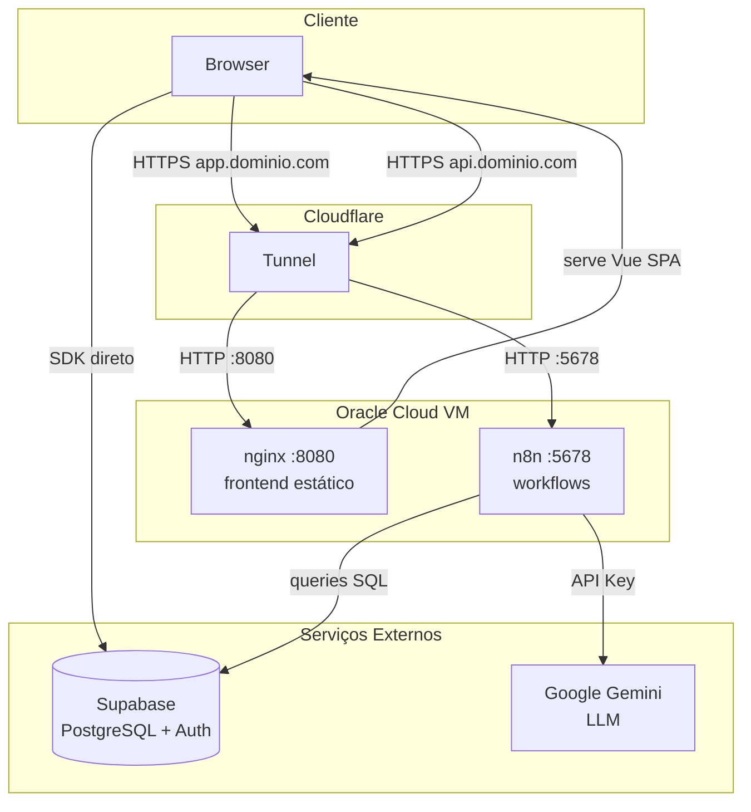
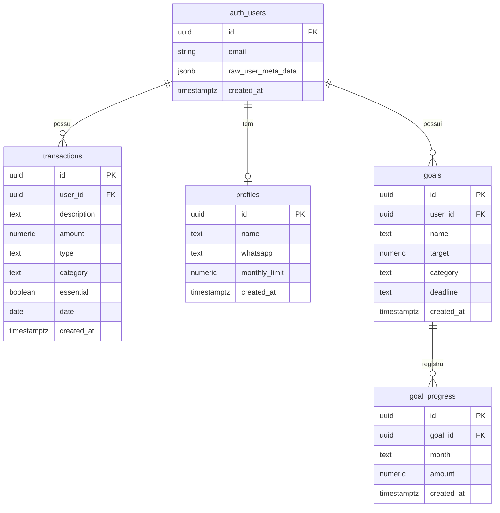

# 💰 Finanças Pessoais

Plataforma de controle financeiro pessoal com suporte a múltiplos usuários. Frontend em Vue 3, backend em n8n, banco de dados no Supabase e infraestrutura self-hosted na Oracle Cloud via Docker Compose.

---

## Arquitetura



---

## Banco de Dados



---

## Stack

| Camada | Tecnologia |
|--------|-----------|
| Frontend | Vue 3 + Vite |
| Autenticação | Supabase Auth |
| Banco de dados | Supabase (PostgreSQL) |
| Automações | n8n |
| IA / LLM | Google Gemini |
| Servidor web | nginx (Alpine) |
| Infraestrutura | Docker Compose |
| VM | Oracle Cloud Always Free (ARM A1) |
| HTTPS | Cloudflare Tunnel |

---

## Funcionalidades

- Cadastro e login com email/senha
- Campo de WhatsApp no cadastro para alertas automáticos
- Dados isolados por usuário (Row Level Security)
- Painel com cards de Renda, Gastos Essenciais e Saldo do mês
- Classificação automática de categoria e essencialidade via Gemini
- Histórico de transações com filtro por mês
- Metas financeiras com termômetro de progresso e histórico mensal
- Limite mensal configurável com alerta via WhatsApp
- Dark mode / Light mode

---

## Estrutura do Projeto

```
.
├── docker-compose.yml
├── .env.example
├── frontend/
│   ├── src/
│   │   ├── views/
│   │   │   ├── Login.vue
│   │   │   ├── Register.vue
│   │   │   ├── Dashboard.vue
│   │   │   └── Metas.vue
│   │   ├── App.vue
│   │   ├── router.js
│   │   ├── supabase.js
│   │   ├── style.css
│   │   └── main.js
│   ├── vite.config.js
│   └── package.json
└── infra/
    ├── cloudflared-setup.sh
    └── create-vm.ps1
```

---

## Configuração

### 1. Variáveis de ambiente

Copie o `.env.example` e preencha:

```bash
cp .env.example .env
```

```env
N8N_JWT_SECRET=
GEMINI_API_KEY=
DB_POSTGRESDB_HOST=
DB_POSTGRESDB_PORT=5432
DB_POSTGRESDB_DATABASE=postgres
DB_POSTGRESDB_USER=postgres
DB_POSTGRESDB_PASSWORD=
WEBHOOK_URL=https://api.seudominio.com
N8N_CORS_ALLOWED_ORIGINS=https://app.seudominio.com
```

### 2. Frontend

```bash
cd frontend
cp .env.example .env   # adicione VITE_SUPABASE_URL e VITE_SUPABASE_ANON_KEY
npm install
npm run build          # gera o dist/ servido pelo nginx
```

### 3. Supabase — criar tabelas

Execute no SQL Editor do Supabase:

```sql
create table transactions (
  id uuid primary key default gen_random_uuid(),
  user_id uuid references auth.users not null,
  description text not null,
  amount numeric not null,
  type text check (type in ('income','expense')) not null,
  category text not null,
  date date not null,
  created_at timestamptz default now()
);
alter table transactions enable row level security;
create policy "users own transactions" on transactions
  using (auth.uid() = user_id);

create table goals (
  id uuid primary key default gen_random_uuid(),
  user_id uuid references auth.users not null,
  name text not null,
  target numeric not null,
  category text not null,
  deadline text not null,
  created_at timestamptz default now()
);
alter table goals enable row level security;
create policy "users own goals" on goals
  using (auth.uid() = user_id);

create table goal_progress (
  id uuid primary key default gen_random_uuid(),
  goal_id uuid references goals on delete cascade not null,
  month text not null,
  amount numeric not null,
  created_at timestamptz default now()
);
alter table goal_progress enable row level security;
create policy "users own goal_progress" on goal_progress
  using (exists (
    select 1 from goals where goals.id = goal_id and goals.user_id = auth.uid()
  ));
```

### 4. Subir os serviços

```bash
docker compose up -d
```

### 5. Cloudflare Tunnel

```bash
sudo bash infra/cloudflared-setup.sh
```

---

## Desenvolvimento local

```bash
cd frontend
npm run dev
# acesse http://localhost:5173
```

---

## Comandos úteis

```bash
# Ver logs do n8n
docker compose logs -f n8n

# Reiniciar serviço
docker compose restart n8n

# Status do tunnel
systemctl status cloudflared
```
